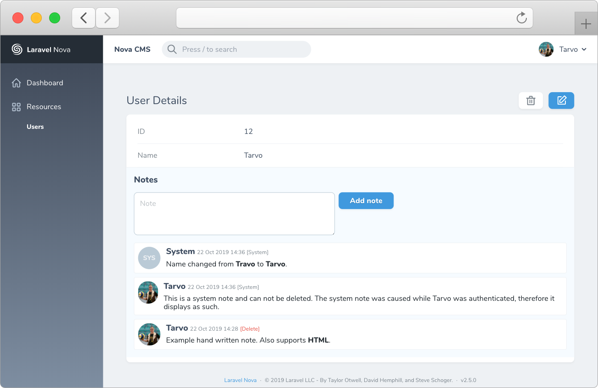

# Nova Notes Field

[](https://packagist.org/packages/outl1ne/nova-notes-field)
[](https://packagist.org/packages/outl1ne/nova-notes-field)

This [Laravel Nova](https://nova.laravel.com) package adds a notes field to Nova's arsenal of fields.

## Requirements

- `php: >=8.0`
- `laravel/nova: ^4.0`

## Features

- Notes field on Detail view
- Differentiation between user-added and system-added notes
- Ability to add notes through the UI or programmatically
- Ability to delete user-made notes (w/ confirmation modal)
- Customizable placeholder support
- Set ability to hide or show the 'Add Note' button

## Screenshots



## Installation

```bash
# Install the package via Composer
composer require outl1ne/nova-notes-field

# Run automatically loaded migration(s)
php artisan migrate
```

## Usage

Add `HasNotes` trait to the model that has the notes:

```php
use Outl1ne\NovaNotesField\Traits\HasNotes;

class ExampleModel extends Model
{
    use HasNotes;
}
```

Add `NotesField` to the matching resource:

```php
use Outl1ne\NovaNotesField\NotesField;

class SomeResource extends Resource
{
  // ...

  public function fields(Request $request)
  {
    return [
      // ...
      NotesField::make('Notes')
        ->placeholder('Add note') // Optional
        ->addingNotesEnabled(false) // Optional
        ->fullWidth(), // Optional
    ]
  }
}
```

## Adding notes programmatically

To add notes programmatically, use the method provided by the `HasNotes` trait:

```php
/**
 * Creates a new note and attaches it to the model.
 *
 * @param string $note The note text which can contain raw HTML.
 * @param bool $user Enables or disables the use of `Auth::user()` to set as the creator.
 * @param bool $system Defines whether the note is system created and can be deleted or not.
 * @return \Outl1ne\NovaNotesField\Models\Note
 **/
public function addNote($note, $user = true, $system = true)
```

## Configuration

### Publish configuration

You can publish the configuration by running:

```bash
php artisan vendor:publish --provider="Outl1ne\NovaNotesField\NotesFieldServiceProvider" --tag="config"
```

The available configuration option(s):

| Config            | Type     | description                                                                                                                                                  |
| ----------------- | -------- | ------------------------------------------------------------------------------------------------------------------------------------------------------------ |
| get_avatar_url    | callable or string | Either enter the url attribute name on your model or a callable which allows you to generate your own URL for the user. The input parameter is the user model. By default, Gravatar is used for the user's avatars. |
| table_name        | string   | Optionally provide your own table name for the notes table. Default is `nova_notes`.                                                                         |
| notes_model       | string   | Optionally provide your own Note model.                                                                                                                      |
| date_format       | string   | Optionally provide custom moment.js compatible date format.                                                                                                  |
| use_trix_input    | boolean  | Optionally enable Trix WYSIWYG input by setting this to `true`.                                                                                              |
| full_width_inputs | boolean  | Optionally force all notes fields to display in full width.                                                                                                  |
| display_order     | string   | Optionally set the sort order for notes. Default is `DESC`.                                                                                                  |

## Custom delete authorization

By default, only the user that wrote the note can delete it and no one can delete system notes.

You can define which user(s) can delete which notes by defining a new Laravel authorization Gate called `delete-nova-note`.

In your `AuthServiceProvider.php` add a Gate definition like so:

```php
use Illuminate\Support\Facades\Gate;
use Outl1ne\NovaNotesField\Models\Note;

// ...

public function boot()
{
  Gate::define('delete-nova-note', function ($user, Note $note) {
    // Do whatever here, ie:
    return $note->created_by === $user->id || $user->isAdmin;
  });
}
```

## Localization

The translation file(s) can be published by using the following publish command:

```bash
php artisan vendor:publish --provider="Outl1ne\NovaNotesField\NotesFieldServiceProvider" --tag="translations"
```

You can add your translations to `resources/lang/vendor/nova-notes-field/` by creating a new translations file with the locale name (ie `se.json`) and copying the JSON from the existing `en.json`.

## Publishing migrations (optional)

If you want to edit the migration(s), you can publish the migrations like so:

```bash
php artisan vendor:publish --provider="Outl1ne\NovaNotesField\NotesFieldServiceProvider" --tag="migrations"
```

## Credits

- [Tarvo Reinpalu](https://github.com/Tarpsvo)

## License

This project is open-sourced software licensed under the [MIT license](LICENSE.md).
